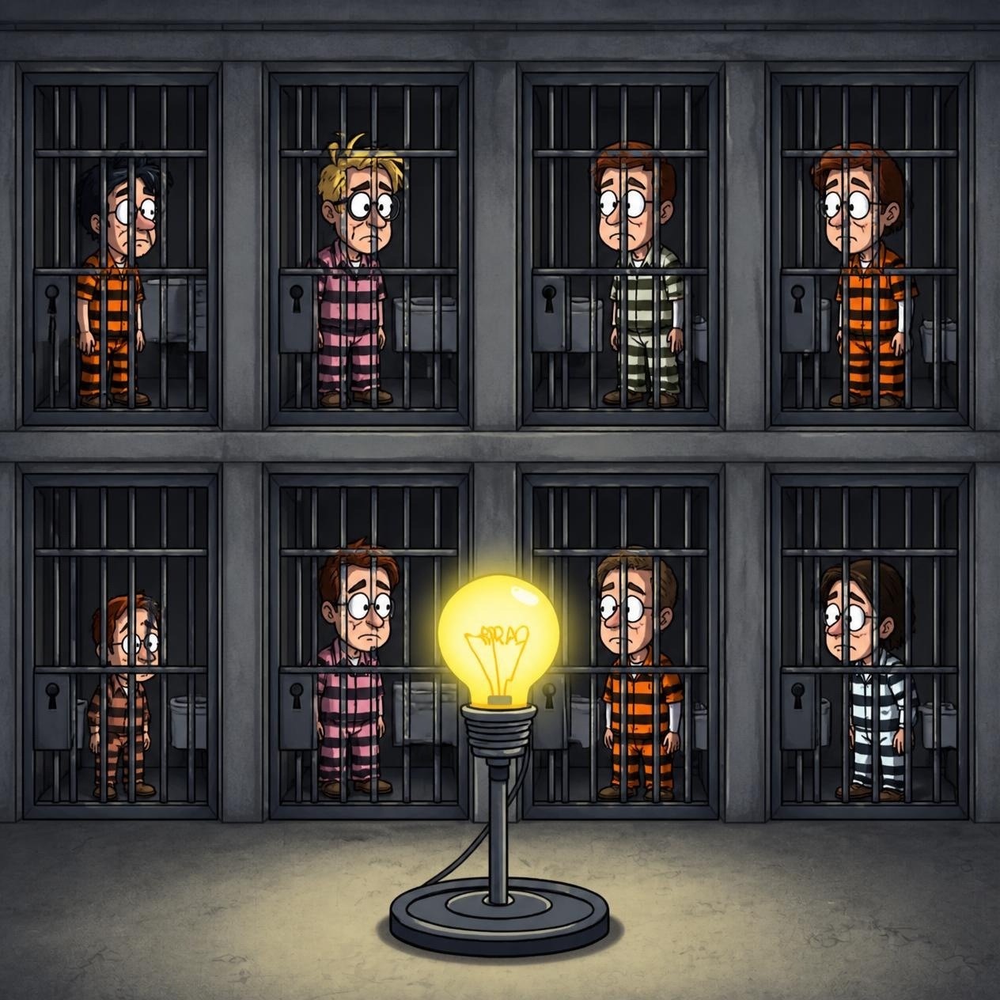

<style>
  p {
    margin-bottom: 0em;
  }

pre {
  line-height: 0.9em;
  display: block;
  margin: 0 auto;
}
  h2 {
    margin-bottom: 1em;
    font-size: 2em;
  }

  .caption-text {
    font-size: 0.9em;
    line-height: 1.5em;
    text-align: center;
    margin-right: 1em;
    margin-left: 1em;
    margin-top: 0em;
    color: var(--text-secondary);
  }

  .centered-image img {
    display: block;
    margin: 0 auto;
    margin-bottom: 0.7em;
  }

  .centered-image-presents img {
    display: block;
    margin: 0 auto;
    margin-bottom: 0.7em;
    max-height: 32em;
    object-fit: contain;
  }

  .with-border img {
    border-radius: 8px;
    border: 1px solid black;
  }

  .image-container {
    display: flex;
    gap: 0.5%;
    justify-content: center;
    flex-wrap: wrap;
  }

  .image-container .double-image-and-caption {
    display: flex;
    width: 49.75%;
    flex-direction: column;
    margin-bottom: 0em;
  }

  .katex {
    overflow-x: auto;
  }

</style>

<div classname="centered-image-presents">



</div>

# WIP

## The Puzzle
One hundred prisoners have been newly ushered into prison. The warden tells
them that starting tomorrow, each of them will be placed in an isolated cell,
unable to communicate with each other. Each day, the warden will choose
one of the prisoners uniformly at random and bring them to
an interrogation room containing only a single light bulb, which is initially switched off.
The prisoner will be able to observe the current state of the light bulb, 
as well as toggle it if they wish. The prisoner also has the option of announcing that
they believes all prisoners have visited the interrogation room at some point in
time. If this announcement is true, then all prisoners are set free, but if it is
false, all prisoners are executed. The warden leaves, and the prisoners huddle 
together to discuss their fate. Can they agree on a procedure that will guarantee their freedom in as short a time as possible?

## Solutions

Solutions are presented in order of increasing optimality / complexity. 
>Note: This puzzle is quite a bit more famous than the puzzles I typically cover - if you’re even slightly interested in logic puzzles, odds are that you’ve seen this one before. However, most sources I've come across present an unoptimal procedure (described in solution #2) as the answer. With a couple intuitive optimizations, we can do quite a bit better!

### Solution #1: Lucky Combinations
**Procedure**: The prisoners prearrange to track their time in prison in 100 day chunks. During their stay, they act as follows:
- If it is a prisoner's first time visiting the interrogation room in a given 100 day chunk, do nothing.
- if it is a prisoner's second time visiting the interrogation room in a given 100 day chunk, turn the lightbulb on.
- On the last day of each 100 day chunk, if the light bulb is off, declare that every prisoner has visited the interrogation room. Otherwise, turn the lightbulb off.

This procedure allows the prisoners to detect whether each person was brought to the interrogation room exactly once during a pre-determined 100 day chunk. If so, the light will remain off on the last day of the chunk. If any prisoner was selected more than once in the chunk, they turn the bulb on, signalling to the prisoner entering on the 100th day that there has been at least 1 repeat. That prisoner then turns the bulb off, and a new chunk of 100 days is tested. <br /> <br />
Under this procedure, the expected number of days until the prisoners declare for freedom is calculated as follows: 
$$
\begin{align*}

\end{align*}
$$
### Solution #2: One Counting Prisoner
The results can be validated with a quick simulation:
```py
import random

NUM_ITERATIONS = 1000
NUM_PRISONERS = 100

simulated_results = []

def num_days_for_new_prisoner(counting_prisoner, flipped_light_prisoners):
    num_days = 1
    while True:
        chosen_prisoner = random.randint(1, NUM_PRISONERS)
        if chosen_prisoner in flipped_light_prisoners or chosen_prisoner == counting_prisoner:
            num_days += 1
            continue
        flipped_light_prisoners.add(chosen_prisoner)
        return num_days

def num_days_for_counter(counting_prisoner):
    num_days = 1
    while True:
        chosen_prisoner = random.randint(1, NUM_PRISONERS)
        if chosen_prisoner != counting_prisoner:
            num_days += 1
            continue
        return num_days

for i in range(0, NUM_ITERATIONS):
    flipped_light_prisoners = set()
    counting_prisoner = random.randint(1, NUM_PRISONERS)
    num_days_for_escape, counting_prisoner_count = 1, 1
    while counting_prisoner_count < NUM_PRISONERS:
        num_days_for_escape += num_days_for_new_prisoner(counting_prisoner, flipped_light_prisoners)
        num_days_for_escape += num_days_for_counter(counting_prisoner)
        counting_prisoner_count += 1
    simulated_results.append(num_days_for_escape)

mean = sum(simulated_results) / NUM_ITERATIONS
std_dev = (sum((x - mean) ** 2 for x in simulated_results) / NUM_ITERATIONS)**0.5

print(
    f"Avg: {mean:.0f}\n"
    f"Min: {min(simulated_results)}\n"
    f"Max: {max(simulated_results)}\n"
    f"Std Deviation: {(sum((x - mean)**2 for x in simulated_results) / NUM_ITERATIONS)**0.5:.0f}"
)
```
Output:
> Avg: 10412 <br />
> Min: 7418 <br />
> Max: 14379 <br />
> Std Deviation: 998