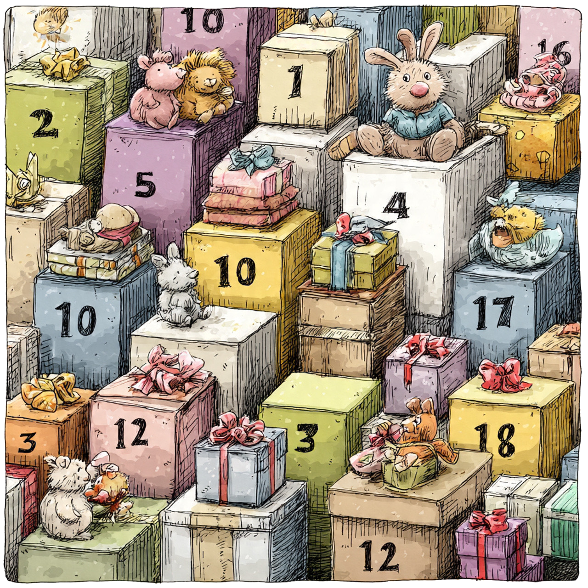
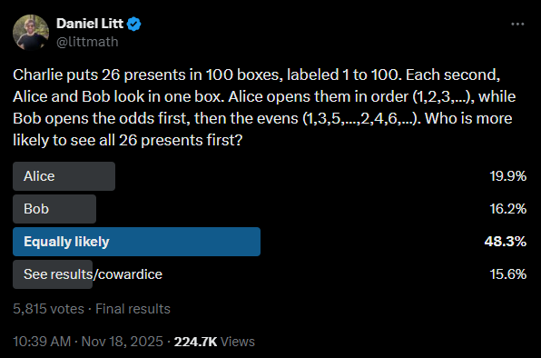

<style>
  p {
    margin-bottom: 0em;
  }

pre {
  line-height: 0.9em;
  display: block;
  margin: 0 auto;
}
  h2 {
    margin-bottom: 1em;
    font-size: 2em;
  }

  .caption-text {
    font-size: 0.9em;
    line-height: 1.5em;
    text-align: center;
    margin-right: 1em;
    margin-left: 1em;
    margin-top: 0em;
    color: var(--text-secondary);
  }

  .centered-image img {
    display: block;
    margin: 0 auto;
    margin-bottom: 0.7em;
  }

  .centered-image-presents img {
    display: block;
    margin: 0 auto;
    margin-bottom: 0.7em;
    max-height: 32em;
    object-fit: contain;
  }

  .with-border img {
    border-radius: 8px;
    border: 1px solid black;
  }

  .image-container {
    display: flex;
    gap: 0.5%;
    justify-content: center;
    flex-wrap: wrap;
  }

  .image-container .double-image-and-caption {
    display: flex;
    width: 49.75%;
    flex-direction: column;
    margin-bottom: 0em;
  }

  .katex {
    overflow-x: auto;
  }

</style>

<div classname="centered-image-presents">



</div>

## Puzzle
Charlie puts 26 presents in 100 boxes, labeled 1 to 100. Each second, Alice and Bob look in one box. Alice opens them in order (1,2,3,...), while Bob opens the odds first, then the evens (1,3,5,...,2,4,6,...) Who is more likely to see all 26 presents first?
  
## Intuitive Solution

To get a sense of what the answer is, we can break down the puzzle into two cases: the case where the highest numbered box that contains a present is even, and the case where the highest numbered box that contains a present is odd. The probability of each case is *roughly* 50% (although not quite, which we'll prove in the following section). 

If the highest numbered box that contains a present is even, Bob cannot win. This is because both
Alice and Bob reveal the 26th present precisely when they open this box. Since Alice opens all
even boxes before Bob (with the small exception box box 100, which they both open at the same time), she is guaranteed to never lose in this scenario.

If the highest numbered box that contains a present is odd, there are still plenty of scenarios in which Alice wins. Take, for example, the scenario where the two highest numbered boxes with presents in them are boxes 80 and 81. Alice reveals all 26 presents in 81 seconds, but it will take Bob 90 seconds to do the same (50 seconds to uncover all the odd boxes, and then 40 more seconds to uncover even boxes until he uncovers box 80).

By looking at the two scenarios above, we can intuitively conclude that Alice should be more likely to reveal all 26 presents first.

## Rigorous Solution

Intuition is nice and all, but cold hard numbers are better! We begin our rigorous solution by calculating the exact probabilities of the two cases outlined above - that the highest numbered box that contains a present is even / odd. First, let's define three terms that will be used extensively in the rest of this writeup:
>$i$: the highest numbered box that contains a present <br />
>$p$: the probability a given box contains a present, (0.26) <br />
>$q$: the probability a given box does not contain a present, (0.74) <br />

With our terms defined, we can now calculate the aforementioned probabilities:

$$
\begin{align*}
\Pr(\text{\emph{i} is even})
    &= \Pr(\text{Box 100 has a present}) \\
    &\quad + \Pr(\text{Box 98 has a present and boxes 99 and 100 do not}) \\
    &\quad + \Pr(\text{Box 96 has a present and boxes 97--100 do not}) \\
    &\quad + \cdots \\
    &\quad + \Pr(\text{Box 26 has a present and boxes 27--100 do not}) \\
    &=(p) \\
    &\quad +(p)(q)^2 \\
    &\quad +(p)(q)^4 \\
    &\quad + \cdots \\
    &\quad +(p)(q)^{74} \\
    &= \frac{p(1 - q^{37})}{1 - q^{2}} \quad \text{(Sum of geometric series with }q^2\text{ as the common ratio)}\\
    &= 0.5747
\end{align*}
$$

It follows from the above that the probability of $i$ being odd is 0.4253.

Additionally, let's calculate the probability that all 26 presents happen to be placed into even boxes:

$$
\Pr(\text{all 26 presents are in an even box})= \\\\[0.5cm]
\quad \frac{\text{\# of configurations where all 26 presents are in even boxes}}{\text{\# of total configurations possible}} = \\\\[0.5cm]
\quad \frac{\binom{50}{26}}{\binom{100}{26}} = \\\\[0.5cm]
1.73*10^{-10}
$$

As there are the same amount of even and odd boxes, the probability that all 26 boxes happen to be placed into odd boxes is also $1.73*10^{-10}$. Since these probabilities are ***extremely*** small, I'll save us some time and digital paper by disregarding these scenarios in future calculations - including them wouldn't make a noticable difference in our final computed probabilities.

Finally, let's calculate the amount of time it takes Alice and Bob to reveal all 26 presents. For this, we'll define two additional terms: <br />
>$e$: the highest even-numbered box that contains a present <br />
>$o$: the highest odd-numbered box that contains a present

Defining these terms makes calculating how long it takes each participant to reveal all 26 presents simple - Alice reveals the 26th present in exactly $\text{max}(e, o)$ seconds, while 
Bob reveals the 26th present in exactly $50 + \frac{e}{2}$ seconds (Bob reveals all 50 odd boxes first, then reveals all even boxes
sequentially until he reveals box $e$).

Armed with the above information, we can now begin calculating the exact probability that Bob reveals all 26 presents first.

<br />
<br />

### Calculating Bob's Probability to Win

First, we split the possible configurations of presents into two cases, $e$ > $o$, and $e$ < *0*. 

**e > o:** <br />
Alice reveals all 26 presents in $e$ seconds, and Bob reveals all 26 presents in $50 + \frac{e}{2}$ seconds. For any $e \leq 100$, $e \leq 50 + \frac{e}{2}$. Therefore, Bob can never win in this scenario.

**e < o:** <br />
Alice reveals all 26 presents in $o$ seconds, and Bob reveals all 26 presents in $50 + \frac{e}{2}$ seconds. Therefore, Bob wins if $50 + \frac{e}{2} < o$. We can calculate Bob's overall probability of winning by taking the weighted average of his probability of winning over all possible values of $e$ as follows:

$$
\begin{align*}
\Pr(\text{Bob wins}) &= \sum_{x \in E}\Pr(e=x)\Pr(o>50+\frac{x}{2} \mid e = x)\\[0.4cm]
&\approx \sum_{x \in E}\Pr(e=x)\Pr(o>50+\frac{x}{2}) \\[0.4cm]

&=\sum_{n=1}^{50}\Pr(e=2n)\Pr(o>50+n) \\
\end{align*}
$$

Note that this probability is technically an approximation, as conditional probabilities are equal to their unconditional counterparts only if the random variables in question are *independent*. That is, $\Pr(o>50+\frac{x}{2} \mid e = x) = \Pr(o>50+\frac{x}{2} )$ only if $e$ and $o$ are independent. In this case, $e$ and $o$ actually have a (very) weak inverse correlation. To understand the inverse correlation intuitively, imagine that $e = 2$. This means that there are 25 odd boxes with presents in them, immediately forcing $o > 50$. This constraint does not exist if $e=100$. Luckily for us, this correlation only becomes noticable for very low values of $e$ and $o$. These scenarios are extremely unlikely, so treating $e$ and $o$ as independent random variables will not noticebly skew our final computed probabilities.

With that out of the way, let's breakdown $\Pr(e=2n)$ into something we can actually calculate:

$$
\begin{align*}
\Pr(e=2n) &= \Pr(\text{Box 2n has a present}) \\
  &\quad * \Pr(\text{Box 2n+2 does not have a present}) \\
  &\quad * \Pr(\text{Box 2n+4 does not have a present}) \\
  &\quad * \cdots \\
  &\quad * \Pr(\text{Box 100 does not have a present}) \\
&=(p)(q)^{50-n} 
\end{align*}
$$

We'll do the same for $\Pr(o > 50 + n)$:

$$
\begin{align*}
\Pr(o > 50 + n) &= 1 -\Pr(o <= 50 + n) \\
  &= 1 - \Pr(\text{No odd numbers higher than 50 + n are included}) \\
  &= 1 - q^{\text{\# of odd numbers between n + 50 and 100}} \\
  &= 1 - q^{\lfloor\frac{50-n}{2}\rfloor} \\
\end{align*}
$$

With all of the above, we can finally calculate Bob's probability of revealing all 26 presents first:

$$
\begin{align*}
\Pr(\text{Bob wins})
&\approx\sum_{n=1}^{50}\Pr(e=2n)\Pr(o>50+n) \\
&=\sum_{n=1}^{50}(p)(q)^{50-n}(1 - q^{\lfloor\frac{50-n}{2}\rfloor}) \\
&= 0.2394
\end{align*}
$$

<br />
<br />

### Calculating The Probability of a Tie

We again split the possible configurations of presents into two cases, $e > o$ and $e < o$.

**e > o:** <br />
Alice reveals all 26 presents in $e$ seconds, and Bob reveals all 26 presents in $50 + \frac{e}{2}$ seconds. $e = 50 + \frac{e}{2}$
only when e = 100, so the the probability of a tie is simply the probability that $e=100$, or 0.26. 

**e < o:** <br />
Alice reveals all 26 presents in $o$ seconds, and Bob reveals all 26 presents in $50 + \frac{e}{2}$ seconds. Therefore, a tie occurs when $50 + \frac{e}{2} = o$. This probability can again be calculated by taking a weighted average over all possible values of $e$:
$$
\begin{align*}
\Pr(\text{Tie}) &= \sum_{x \in E}\Pr(e = x)\Pr(o=50+\frac{x}{2} \mid e = x)\\[0.2cm]
&\approx \sum_{x \in E}\Pr(e = x)\Pr(o=50+\frac{x}{2})\\[0.2cm]
&=\sum_{n=1}^{25}\Pr(e = 4n-2)\Pr(o=2n+49)\\[0.2cm]
&=\sum_{n=1}^{25}pq^{51-2n}pq^{25-n}\\[0.2cm]
&=\sum_{n=1}^{25}p^2q^{76-3n}\\[0.2cm]
&= 0.0841
\end{align*}
$$

Notice that just like when we calculated Bob's probability to win, we again treat $e$ and $o$ as independent random variables. 
We'll show how inconsequential this approximation is in the upcoming section. 

Combining the above two scenarios, we arrive at an overall probability of $0.26 + 0.0841 = 0.3441$ for a tie. <br />

<br />
<br />

### Checking Our Work

At this point you may be wondering if I'm just throwing numbers around and hoping no one looks too close. Or maybe you're skeptical of all those times I treated $e$ and $o$ as independent random variables even though they're *technically*&nbsp; not. Well, in this section I put both doubts to rest. Let's start by reminding ourselves of the probabilities we calculated:

>**Probability Bob wins:** (0.2394) <br />
>**Probability of a tie:** (0.3441) <br />
>**Probability Alice wins:** (0.4165) (derived from the above) <br />

Now, let's bang out a simple python script that estimates the true probabilities by running a bunch of simulated games:

```py
import random

def simulate_boxes(num_simulations):
    num_ties = 0
    alice_wins = 0
    bob_wins = 0

    for _ in range(num_simulations):
        chosen_numbers = set(random.sample(range(1, 101), 26))
        alice_order = list(range(1, 101))
        bob_order = list(range(1, 100, 2)) + list(range(2, 101, 2))
        
        alice_presents_seen = 0
        alice_time = 0
        for time, box in enumerate(alice_order):
            if box in chosen_numbers:
                alice_presents_seen += 1
                if alice_presents_seen == 26:
                    alice_time = time + 1  
                    break
        
        bob_presents_seen = 0
        bob_time = 0
        for time, box in enumerate(bob_order):
            if box in chosen_numbers:
                bob_presents_seen += 1
                if bob_presents_seen == 26:
                    bob_time = time + 1  
                    break
        
        if alice_time == bob_time:
            num_ties += 1
        elif alice_time < bob_time:
            alice_wins += 1
        else:
            bob_wins += 1
        
    alice_probability = alice_wins / num_simulations
    bob_probability = bob_wins / num_simulations
    tie_probability = num_ties / num_simulations
    
    print(f"Alice win probability: ({alice_probability*100:.2f}%)\n")
    print(f"Bob win probability: ({bob_probability*100:.2f}%)\n")
    print(f"Tie probability: ({tie_probability*100:.2f}%)\n")
    
if __name__ == "__main__":
    simulate_boxes(1000000)
```

Output:

> Alice win probability: (41.65%) <br />
> Bob win probability: (23.95%) <br />
> Tie probability: (34.40%) <br />

Our calculated probabilities are less than a hundredth of a percent off of the estimated true probabilities - well within the bounds of variance!

## Conclusion

Whew, that turned out to be way more work than I was expecting! If you enjoyed this puzzle breakdown,
take a look at some of the other ones on this blog, or peep my [interactive puzzle website!](https://theriddleman.com)
Also check out Daniel Litt on Twitter - I was inspired to make this breakdown when a friend sent me this [Twitter poll:](https://x.com/littmath/status/1990807150101475653)

<br />

<div classname="centered-image with-border">


<div classname="caption-text">
More than 80% of people were bamboozled by this puzzle!
</div>
</div>

<br />
<br />