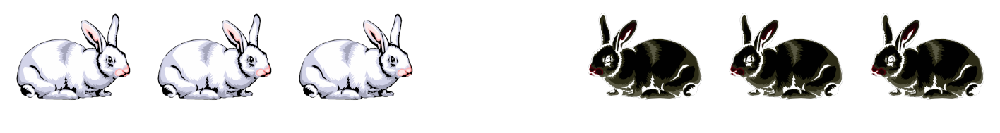

## The Puzzle
You are called upon to reorganize a group of rabbits. The rabbits are initially lined up in a single-file row as shown below:

Three white rabbits facing right, one empty spot, and then three black rabbits facing left.

 

The rabbits may move as follows:
1. A rabbit may only move in the direction it is facing.

2. A rabbit may move one space forward to an open spot, or it may jump over one other rabbit to reach an open spot.

Following the above rules, can you rearrange the rabbits so that all the black rabbits end up on the left and all the white rabbits end up on the right?

[Try the interactive version of the puzzle here!](https://theriddleman.com/rabbitRiddle)

 

## Solution

The key trick to this puzzle is that the rabbits must be "interwoven". That is, we should never perform a move that puts two rabbits of the same color next to each other (until they reach their ending positions). This prevents deadlocks, situations in which there are no valid moves. That's it! Performing moves that interweave the rabbits and prevent premature deadlocks will naturally lead you to the solution:

Animation showing the solution

 
 

## Bonus Puzzle
Imagine that instead of 3 rabbits of each color, there were $n$ rabbits of each color. How many moves would it take to rearrange them in the same fashion as before? 

## Solution
To calculate how many moves it takes to rearrange a group consisting of $n$ rabbits of each color, we first calculate how 
many total spaces the rabbits must traverse in order to reach their ending positions. To reach its ending position, 
the furthest left-most white rabbit must swap places with the furthest left-most black rabbit, the 2nd furthest 
left-most white rabbit must swap places with the 2nd furthest left-most black rabbit, and so on. 
This is illustrated in the visualization below:

 Each rabbit must switch positions with the opposing rabbit of the corresponding color to reach their ending position.

 

From the above, we can clearly see that each rabbit must traverse $n + 1$ spaces to reach its ending position. 
Multiplying the total number of rabbits, $2n$, by the number of spaces each rabbit needs to traverse, $n + 1$, gives us an expression
for the total number of spaces the rabbits (as a whole) must traverse: $2n * (n + 1) = 2n^2 + 2n$.  

 

Now, notice that a "standard" move advances a rabbit by 1 space, while a "jump" advances a rabbit by 2 spaces. 
This fact allows us to calculate the number of moves needed to rearrange the rabbits. We simply subtract the number of jumps
performed from the total number of spaces the rabbits must traverse! Finding the total number 
of jumps performed is simple - each of the $n$ white rabbits must jump over or be jumped over by each of the $n$ black rabbits.
Regardless of which scenario happens, a jump is performed, so the total number of jumps that occur while rearranging
the rabbits is $n^2$.

 

Subtracting the number of jumps performed from the total number of spaces the rabbits must traverse gives us the exact formula for the number of moves needed to rearrange the rabbits: $2n^2 + 2n - n^2 = n^2+2n$

 