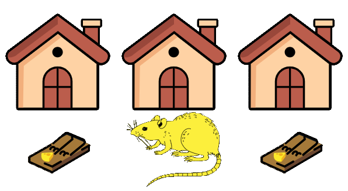
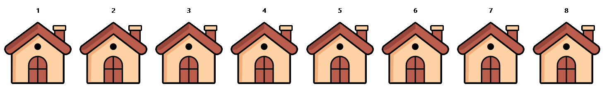
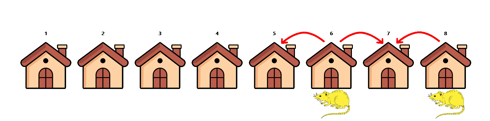

<!-- TODO: move blog styles to a centralized place -->

## The Puzzle

There's a rat on the loose in your 8 house neighborhood, and it's your job to catch it! The rat starts in a random house and moves to an adjacent house every night. Houses 1 and 8 are not considered adjacent. Each day you
are allowed to trap two houses - if the rat is in one of the two houses you trap, it will be caught. 
If you trap houses 1 and 2 on the first day, 2 and 3 on the second day, and so on, you are guaranteed to catch the rat
in at most 7 days. This, however, is not optimal - what trapping strategy is guaranteed to catch the rat in the fewest number of days? 

[Try the interactive version of the puzzle here!](https://theriddleman.com/ratRiddle)

 

A visualization of the 8 house neighborhood

 

## Solution

To start, let's assume that the rat begins in an even numbered
house, i.e. houses 2, 4, 6, or 8. On the first day, we trap houses 2
and 4. If we don't catch the rat, that means the rat started in
house 6 or 8. Now, notice that the only houses adjacent to house 6
and 8 are houses 5 and 7. Since the rat has to move to an adjacent
house each day, we can trap houses 5 and 7 on the second day,
guaranteeing that we will catch the rat if it started in an even
numbered house. If we don't find the rat on day 2, we can
definitively conclude that the rat started in an odd numbered house!

If a rat is currently in house 6 or 8, it must move to either
house 5 or 7 on the next day.

 

If the rat started in an odd numbered house, then on the third day
it will also be in an odd numbered house (notice that the parity of
the house number the rat is in flips each day). Thus, we can employ
a similar strategy to before: on day 3, we check houses 5 and 7. If
we don't find the rat, then the rat must have been in houses 1 or 3.
Since the only houses adjacent to houses 1 and 3 are houses 2 and 4,
we check those houses on the fourth day, guaranteeing that we catch
the rat in only four days! 

## Implementation

The crux here is how to programmatically verify if a
submitted arrangement of traps will successfully catch the rat. In
this case where there are only 8 houses and a maximum of 7 days, it
would be completely feasible to enumerate all 316 possible paths the
rat can take, then check if all those paths run into a trap using
the submitted arrangement. That's inefficient and lame though! Let's
think of something a little more elegant.

We can think of a submitted solution as a graph with "layers", where
each layer corresponds to a day. Within a day / layer, we represent
each house as a node. The edges will represent how the rat can move
between days - for example, house 2 in the first layer will have two
outgoing edges - houses 1 and 3 in the second layer. Connect all
nodes in the first layer to a start node, and all nodes in the last
layer to an end node. 

The graph built for a 4 day solution. Each row represents a day.

 

To check if a submitted solution is guaranteed to catch the rat,
simply remove the nodes corresponding to trapped houses from the
graph. Check if there still exists a route from the start node to
the end node using a simple path finding algorithm. If such
a path no longer exists, the submitted solution is guaranteed to
catch the rat! 

An invalid solution to the puzzle. There are still many paths
from the start node to the end node.

 

A valid (and optimal!) solution to the puzzle. There is no
longer a path from the start node to the end node.

 
 

## Bonus Puzzle
Can you determine how many days it would take to catch the rat in a neighborhood with an
arbitrary number of houses?

## Solution
To calculate how many days it would take to catch the rat for an arbitrary
number of houses, we again make use of odd / even idea introduced in part 1.
This time we begin from the last day, work backwards to eliminate half of the
houses in a row (i.e. all odd or even houses), then continue on in the same
manner until all houses in a row are eliminated. In the 11 house example
below, red nodes represent rat-trapped houses, and yellow nodes represent
houses in which the rat is guaranteed to run into a rattrap in the future.

Half the houses can be eliminated in 3 days

 

The rat is guaranteed to be caught in 6 days

 

The number of days needed to eliminate half the houses is X1/2 =
Floor(# of houses / 3). The number of days needed to eliminate the rest of the
houses is, in most cases, also X1/2. The one exception is when X
1/2 is even, and the number of houses is divisible by 3. In this
case, the number of days needed to eliminate the rest of the houses is X
1/2 - 1. This is because if the number of houses is divisible by 3,
then on on day X1/2 half the houses are eliminated after one trap
is placed, so the other trap is used to get a head start on eliminating the
rest of the houses. This head start will only make a difference if X
1/2 is even.
</style>

With 12 houses, the rat can be caught in 7 days. The above mentioned "head start" is visible on day 4. 

 

Thus, the number of days needed to catch the rat for any number of 
houses <i>N</i> is given by the expression <i>2X1/2 - 1</i> if 
X1/2 is even and <i>N</i> is divisible by 3, and the 
expression <i>2X1/2</i> otherwise. This is the precise
formula used to validate if a submitted answer to part 2 is correct in the interactive puzzle.

 
