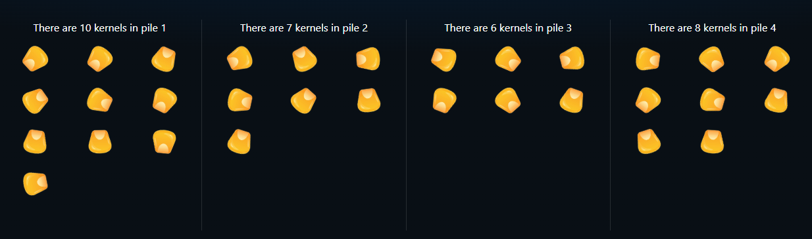
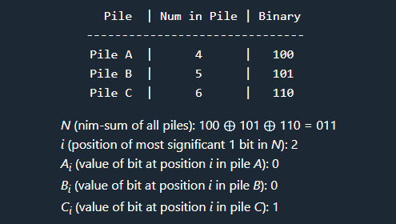

## Puzzle
You must defeat a surprisingly intelligent rooster in a battle of wits involving 4 piles of corn kernels. There are only 3 rules of battle:
 
1. You and the rooster each take turns picking up kernels of corn, with you going first. 
2. Each turn consists of taking a positive number of kernels from a single pile. 
3. The one who takes the last kernel wins.

An example starting position. The starting positions are randomized in the below interactive version!

 

[Try the interactive version of the puzzle here!](https://theriddleman.com/roosterRiddle)

## Proof of Winning Strategy

Before we start with a proof of the winning strategy, let's define
one term which will be used extensively throughout this page:
nim-sum. The nim-sum of a set of numbers is simply the result of
applying bitwise XOR ⊕ over the entire set. For example, the
nim-sum of 4, 5, and 6 is equivalent to 100 ⊕ 101 ⊕ 110 = 011 = 3.
   
For our proof of the winning strategy, we will need to prove three
intermediary lemmas: 

1. The winning move always results in a position where the
nim-sum is 0

2. If the nim-sum of a position is already 0, then there is no
valid move that results in a position with a nim-sum of 0

3. If the nim-sum of a position is not 0, there always exists a move
that results in a position with a nim-sum of 0

 

### Lemma #1: The winning move always results in a position where the nim-sum is 0 

> This lemma is trivial. Simply notice that a winning move results
in there being 0 kernels left in all piles. The nim-sum of any set
made up entirely of 0s is 0. 

 

### Lemma #2: If the nim-sum of a position is already 0, then there is no valid move that results in a position with a nim-sum of 0

> To prove this lemma, let's first assume that there exists a valid
> move from a position with a nim-sum of 0 to a position with a
> nim-sum of 0. Let *N-p* be the nim-sum of all piles 
> except for pile *P*, the pile in which this move occurs. 
> Additionally, let *k* be the number of kernels in *P*,
> and *k'* be the number of kernels in *P* after the above
> move is played.  
>  
> If all of the above is true, then it holds that 
> both *k* ⊕ *N-p*= 0 
> and *k'* ⊕ *N-p*= 0.
> Combining the equations gives *k* ⊕ 
> *N-p* ⊕ *k'* ⊕ *N-p* 
> = *k* ⊕ *k'* = 0. 
> This is true if and ONLY if *k'* = *k*. Taking 0 kernels
> from a pile is not a valid move, so the lemma
> is proven.

 

### Lemma #3: If the nim-sum of a position is not 0, there always exists a move that results in a position with a nim-sum of 0

> This lemma is a little more involved. First, let's define the
> shorthand *Xy*. This is the value of the bit in 
> position *y* of *X's* binary representation. We'll 
> additionally define *N* to be the nim-sum of all of the 
> remaining piles, and *i* to be the position of the most 
> significant 1 bit in *N*. 

The defined terms for a sample position with piles of sizes 4, 5, and 6

> Using the above definitions, there must exist at least one 
> pile *P* where *Pi* = 1. This is due to the 
> fact that if all piles had a 0 in their *i*th position, 
> then *Ni* would also be 0, contradicting our 
> definition of *i*. We will play in this pile, and reduce the 
> number of kernels in *P* from *k* to *k'*. We can 
> construct a *k'* that forces the resulting nim-sum of all the 
> piles *N'* to be 0 by simply 
> setting *k'* = *k* ⊕ *N*. (Intuitively, we
> just flip the value of bits in *k* at any
> position *j* where *Nj* = 1. This ensures 
> that *N'* = 0). Since *Pi* = 1 
> and *Ni* = 1, the most significant bit that is 
> changed in the transformation from *k* to *k'* will 
> always be flipped from 1 to 0, ensuring that *k' < k.* Thus,
> in a position where the nim-sum is not already 0, we can always 
> play a move that results in a nim-sum of 0 by by reducing the 
> number of kernels in pile *P* from *k* to *k'*.

 

### Putting it all together

Combining all three lemmas reveals the winning strategy: on each
of your turns, play a move which results in a position with a
nim-sum of 0. This is is guaranteed to exist if the position does
not already have a nim-sum of 0 (lemma #3). Your opponent will be
forced to play a move that results in a non-zero nim-sum (lemma
#2). This cycle will continue until the winning move is played.
Since the winning move must result in a position with a nim-sum of
0 (lemma #2), you will always win!
   
If you found this breakdown interesting and would like to learn
more, check out the [Wikipedia page on Nim!](https://en.wikipedia.org/wiki/Nim)

 
 

### Implementation

This puzzle's implementation is quite straightforward - on each of
the rooster's turns, the nim-sum of the position is calculated. If
the nim-sum is non-zero, a move derived from the strategy defined
above is played. If the nim-sum is already 0, then a random move
is played. During the initial setup, the amount of kernels in each
pile is randomized. If the resulting position happens to have a
nim-sum of 0, one kernel is added to a random pile, ensuring that
the player always has a winning strategy if they play optimally.

